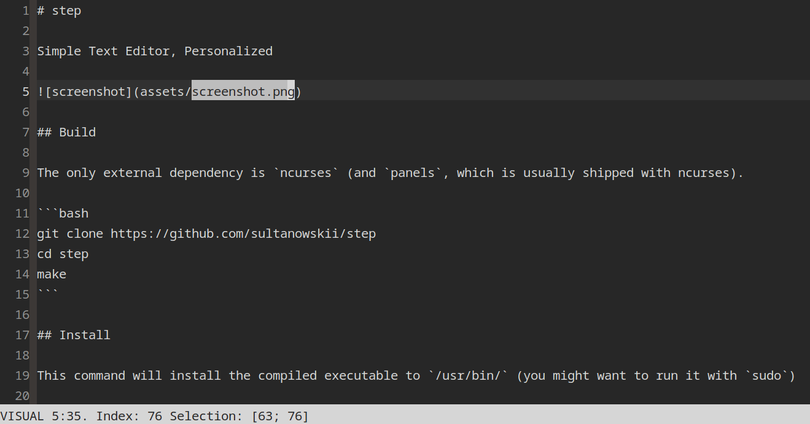

# step

Simple Text Editor, Personalized



## Build

The only external dependency is `ncurses` (and `panels`, which is usually shipped with ncurses).

```bash
git clone https://github.com/sultanowskii/step
cd step
make
```

## Install

This command will install the compiled executable to `/usr/bin/` (you might want to run it with `sudo`)

```bash
make install
```

## Usage

```bash
> ./step
usage: ./step FILENAME
> ./step file.txt
```

### Modes

The idea is very similar to vim. There are:

- Normal (command)
- Insert (the usual text editor experience)
- Visual (selection)

#### All modes

These keys work in all modes:

| Key           | Action            |
|---------------|-------------------|
| ←, ↑, →, ↓    | Navigation keys   |

#### Normal (command) mode

| Key           | Action                       |
|---------------|------------------------------|
| `Ctrl+q`      | Quit                         |
| `Ctrl+s`      | Save                         |
| `u`           | Undo                         |
| `r`           | Redo                         |
| `g`           | Goto Beginning of File (BOF) |
| `G`           | Goto End of File (EOF)       |
| `x`           | Remove one symbol            |
| `p`           | Insert clipboard contents    |
| `i`           | Enter **Insert mode**        |
| `v`           | Enter **Visual mode**        |

#### Insert mode

Basic text mode.

| Key               | Action                                          |
|-------------------|-------------------------------------------------|
| `Ctrl+q` / `Esc`  | Exit **Insert Mode** (= Enter **Normal mode**) |

#### Visual (select) mode

| Key                     | Action                                         |
|-------------------------|------------------------------------------------|
| `c`                     | Copy selected to clipboard                     |
| `x`                     | Cut selected to clipboard                      |
| `d`, `DEL`, `Backspace` | Remove selected                                |
| `Ctrl+q` / `Esc`        | Exit **Visual Mode** (= Enter **Normal mode**) |

## Limitations

- ASCII only
- Internal clipboard only (I'm NOT making the real clipboard support - that's one hell of a nightmare)
- Enormously large files aren't handled in any specific way, therefore some operations (as well as opening/saving) might be slow
- As some other TUIs, could work weirdly in small terminal windows - get a bigger one :)

## About

My biggest pet project so far - I quite like it.
